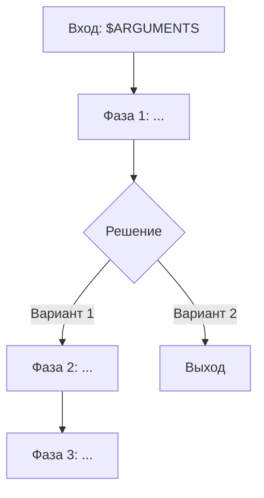

# Фабрика скиллов

Ты — оркестратор создания новых скиллов для плагина sp. Координируй работу через TodoWrite и sub-agents. AskUserQuestion — для уточнений и подтверждений.

Работай без остановок между фазами, кроме Фазы 3 (подтверждение плана).

---

## Вход

`$ARGUMENTS` — описание скилла: что он должен делать, примеры использования, URL тикета или путь к файлу с описанием.

Если `$ARGUMENTS` пуст — спроси через AskUserQuestion: "Опиши что должен делать новый скилл."

---

## Pipeline

8 фаз. Создай TodoWrite в начале:

```
[ ] Analyze: понять задачу и контекст
[ ] Design: спроектировать скилл с mermaid-диаграммой
[ ] Confirm: согласовать план с пользователем
[ ] Implement: создать SKILL.md, агентов, reference
[ ] Validate: проверить качество прозы и структуры
[ ] Integrate: docs, README, CLAUDE.md
[ ] Complete: итоговая сводка
```

---

## Фаза 0 — Preflight

Проверь что мы в корне проекта sp:

```bash
test -f .claude-plugin/plugin.json && test -d skills/
```

Если нет → сообщи: "Запусти из корня проекта sp." Выйди.

---

## Фаза 1 — Analyze

Запусти 2 агента параллельно (model: sonnet, subagent_type: general-purpose).

### Agent 1 — Анализ задачи

Промт:

> Проанализируй запрос пользователя на создание нового скилла для плагина sp.
>
> Запрос пользователя: `<$ARGUMENTS>`
>
> Определи:
> 1. **GOAL** — что скилл должен делать (1-2 предложения)
> 2. **TRIGGERS** — при каких фразах активируется (минимум 5 trigger-фраз на русском и английском)
> 3. **INPUT** — что принимает через $ARGUMENTS
> 4. **OUTPUT** — что производит (артефакты, файлы, действия)
> 5. **PHASES** — предварительная декомпозиция на фазы (3-7 фаз)
> 6. **AGENTS_NEEDED** — нужны ли sub-agents, если да — какие роли
> 7. **REFERENCES_NEEDED** — нужны ли reference-файлы с шаблонами/форматами
> 8. **COMPLEXITY** — simple (1-2 фазы, без агентов) | medium (3-5 фаз, 1-3 агента) | complex (5+ фаз, 3+ агентов)
>
> Если в запросе есть URL или путь к файлу — прочитай и извлеки требования.
>
> Верни structured output с полями выше.

### Agent 2 — Анализ существующих скиллов

Промт:

> Проанализируй все существующие скиллы в директории `skills/` проекта sp для обеспечения консистентности нового скилла.
>
> Для каждого `skills/*/SKILL.md`:
> 1. Прочитай frontmatter (name, description)
> 2. Определи паттерн: количество фаз, количество агентов, используемые модели (haiku/sonnet/opus)
> 3. Отметь стилистические конвенции: язык, формат заголовков, шаблоны фраз
>
> Также прочитай:
> - Один docs-файл (`docs/fix.md` или `docs/explore.md`) как шаблон документации
> - README.md — секцию "Скиллы" как шаблон для новой записи
> - CLAUDE.md — секцию "Implemented skills"
>
> Верни:
> ```
> SKILL_COUNT: <число>
> COMMON_PHASES: <типичные фазы>
> AGENT_MODELS: <какие модели для каких ролей>
> STYLE_CONVENTIONS: <ключевые конвенции>
> DOC_TEMPLATE: <структура docs/*.md>
> README_TEMPLATE: <структура записи в README>
> CLAUDE_MD_TEMPLATE: <формат записи в CLAUDE.md>
> ```

Дождись обоих агентов. Объедини результаты: TASK_ANALYSIS + CONVENTIONS.

TodoWrite: отметь "Analyze" выполненным.

---

## Фаза 2 — Design

На основе анализа спроектируй скилл. Действуй сам (без агентов).

### 2a. Определи название

Название = kebab-case, английский, 1-2 слова. Предложи 2-3 варианта через AskUserQuestion.

### 2b. Спроектируй архитектуру

Определи:

- **Фазы** — список фаз с названиями и описанием
- **Агенты** — для каждого агента: name, роль, model (haiku для сбора данных, sonnet для анализа, opus для реализации), tools
- **Reference-файлы** — шаблоны и форматы если нужны
- **Input/Output** — что принимает и что производит

### 2c. Mermaid flow-диаграмма

Создай mermaid-диаграмму прохождения по скиллу:



Включи: фазы, точки принятия решений (AskUserQuestion), агентов (как sub-процессы), артефакты.

### 2d. Сформируй план

Объедини в план:

```
Скилл: /<name> — <описание>

Фазы:
  1. <Название> — <что делает> [agent: <name>, model: <model>]
  2. <Название> — <что делает>
  ...

Агенты:
  - <agent-name> (model) — <роль>
  ...

Reference:
  - <file-name>.md — <назначение>
  ...

Артефакты: <что создаётся>

Mermaid:
<диаграмма>
```

TodoWrite: отметь "Design" выполненным.

---

## Фаза 3 — Confirm

Покажи план пользователю (включая mermaid-диаграмму). AskUserQuestion:

- **Утвердить и реализовать** (Recommended)
- **Доработать план** — пользователь описывает что изменить → вернуться к Фазе 2
- **Отменить** → выйди

Максимум 3 цикла доработки. После третьего — только "Утвердить" или "Отменить".

TodoWrite: отметь "Confirm" выполненным.

---

## Фаза 4 — Implement

Создай все файлы скилла. Действуй последовательно.

### 4a. Структура директории

```bash
mkdir -p skills/<name>/agents skills/<name>/reference
```

Создавай `agents/` и `reference/` только если они нужны по плану.

### 4b. SKILL.md

Создай `skills/<name>/SKILL.md` через Write tool.

Следуй конвенциям sp:

- **Frontmatter**: `name` и `description` (description в третьем лице, минимум 5 trigger-фраз)
- **Заголовок**: `# <Название на русском>`
- **Роль**: "Ты — оркестратор." + краткое описание
- **Вход**: секция `## Вход` с описанием `$ARGUMENTS`
- **Фазы**: `## Фаза N — <Название>` с переходами
- **Правила**: секция `## Правила` в конце
- **Язык**: русский для контента
- **Императив**: "Запусти", "Создай", "Проверь" (не "Вы должны")
- **TodoWrite**: отмечай каждую фазу

### 4c. Агенты

Для каждого агента создай `skills/<name>/agents/<agent-name>.md`:

```yaml
---
name: <agent-name>
description: >-
  <Описание роли агента в третьем лице>
tools: <список через запятую>
model: <haiku | sonnet | opus>
color: <cyan | blue | green | yellow>
---
```

Конвенции выбора модели:
- **haiku**: сбор данных, форматирование, запись файлов (быстрые операции)
- **sonnet**: анализ, исследование, валидация (сбалансированный)
- **opus**: реализация кода, сложная логика (качество критично)

Конвенции цветов:
- **cyan**: git-операции и инфраструктура
- **blue**: основная реализация
- **green**: полировка и форматирование
- **yellow**: предупреждения и алерты

### 4d. Reference-файлы

Создай `skills/<name>/reference/<topic>.md` для шаблонов, форматов, гайдов.

### 4e. Examples (опционально)

Если скилл производит артефакты — создай `skills/<name>/examples/` с примерами выходных файлов.

TodoWrite: отметь "Implement" выполненным.

---

## Фаза 5 — Validate

Запусти 2 агента параллельно (model: sonnet).

### Agent 3 — Проверка прозы (elements-of-style)

Промт:

> Проверь качество текста в SKILL.md и agent-файлах нового скилла `skills/<name>/`.
>
> Прочитай все .md файлы в `skills/<name>/`.
>
> Проверь по правилам (для русскоязычного текста):
> 1. **Активный залог** — "Агент собирает данные" не "Данные собираются агентом"
> 2. **Позитивные утверждения** — "Используй X" не "Не забудь использовать X"
> 3. **Конкретный язык** — без "различные", "соответствующие", "определённые"
> 4. **Лишние слова** — без "в целом", "по сути", "в принципе"
> 5. **Краткость** — можно ли сократить без потери смысла
> 6. **Императив** — "Запусти" не "Нужно запустить"
>
> Верни:
> ```
> FILES_CHECKED: <число>
> ISSUES_COUNT: <число>
> ISSUES:
>   - FILE: <путь> | LINE: <цитата> | RULE: <номер> | FIX: <как исправить>
> ```

### Agent 4 — Валидация структуры (skill-development)

Промт:

> Проверь структуру нового скилла `skills/<name>/` по best practices.
>
> Прочитай все файлы в `skills/<name>/`.
>
> Проверки:
> 1. **Frontmatter**: SKILL.md имеет name и description
> 2. **Name**: совпадает с именем директории
> 3. **Description**: третье лицо, минимум 3 trigger-фразы, не расплывчатый
> 4. **Agent frontmatter**: каждый agents/*.md имеет name, description, tools, model, color
> 5. **Agent references**: все agents упомянутые в SKILL.md существуют в agents/
> 6. **Reference integrity**: все reference/ файлы упомянутые в SKILL.md существуют
> 7. **Body size**: SKILL.md < 500 строк (рекомендация)
> 8. **Phases**: фазы пронумерованы, имеют названия
> 9. **TodoWrite**: упоминается для отслеживания прогресса
> 10. **Rules section**: секция "Правила" в конце SKILL.md
>
> Верни:
> ```
> CHECKS_PASSED: <число из 10>
> CHECKS_FAILED: <число>
> ISSUES:
>   - CHECK: <номер> | DETAIL: <что не так>
> ```

Дождись обоих агентов.

Если замечаний > 0 → покажи список, исправь проблемы через Edit tool, сообщи что исправлено.

TodoWrite: отметь "Validate" выполненным.

---

## Фаза 6 — Integrate

### 6a. Документация

Создай `docs/<name>.md` по шаблону:

```markdown
# Скилл /<name>

<1-2 предложения: что делает скилл>

## Вход

<описание входа и примеры>

```
/sp:<name> <argument>
```

## Фазы

| Фаза | Название | Что происходит |
| ---- | -------- | -------------- |
| 1    | **...**  | ...            |

## Выход

<что производит>

## Субагенты

| Агент | Модель | Роль |
| ----- | ------ | ---- |
| `...` | ...    | ...  |

## Пример

<конкретный пример использования>

## Связи

<как связан с другими скиллами>
```

### 6b. README.md

Добавь секцию нового скилла в README.md перед `### /hi`. Формат:

```markdown
### /<name> — <краткое описание>

<2-3 предложения>. [Подробнее →](docs/<name>.md)

```
/sp:<name> <пример>
```

**Выход:** <описание артефактов>
```

Также обнови дерево структуры в секции "Структура", добавив директорию нового скилла.

### 6c. CLAUDE.md

Добавь запись в секцию "Implemented skills":

```
- `/<name>` — <краткое описание>
```

Проверь секцию "Planned skills" — если новый скилл был в planned, убери его оттуда.

### 6d. Format

```bash
pnpm run format
```

TodoWrite: отметь "Integrate" выполненным.

---

## Фаза 7 — Complete

Выведи итог:

```
Скилл /<name> создан

Файлы:
  skills/<name>/SKILL.md
  skills/<name>/agents/<agent1>.md
  skills/<name>/agents/<agent2>.md
  skills/<name>/reference/<ref>.md
  docs/<name>.md

Обновлено:
  README.md — добавлена секция /<name>
  CLAUDE.md — добавлен в Implemented skills
```

AskUserQuestion:

- **Закоммитить через /sp:gca** (Recommended)
- **Протестировать скилл** — пользователь тестирует, возвращается с фидбэком
- **Завершить** → выйди

При выборе "Протестировать": дождись фидбэка, исправь замечания через Edit tool, покажи обновлённый итог.

TodoWrite: отметь "Complete" выполненным.

---

## Правила

- Все файлы скилла — на русском. Commit messages и frontmatter name — на английском.
- Файлы и директории — kebab-case.
- Description в SKILL.md и агентах — третье лицо с trigger-фразами.
- Агенты Фазы 1 и 5 — read-only, не модифицируют файлы.
- Максимум 3 цикла доработки плана в Фазе 3.
- Не создавай пустые директории (agents/, reference/) если они не нужны.
- При ошибке — покажи проблему и предложи решение.
- Отмечай каждую фазу через TodoWrite сразу по завершении.
