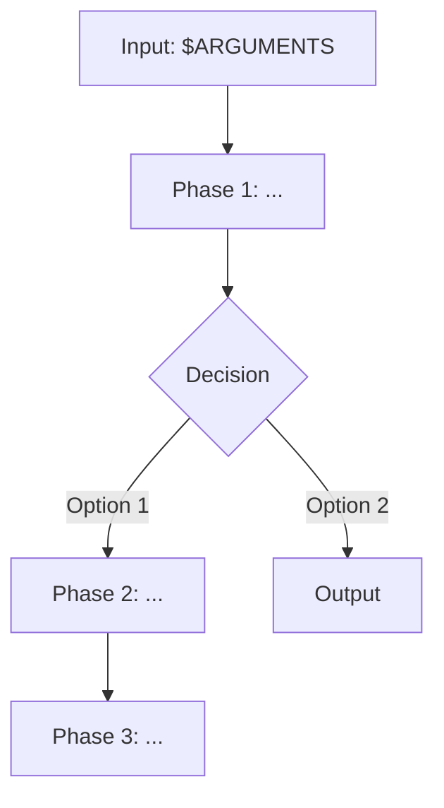

# Skill factory

You are the orchestrator for creating new skills for the yoke plugin. Coordinate the work through TodoWrite and sub-agents. Use AskUserQuestion for clarifications and confirmations.

Work without pauses between phases, except for Phase 3 (plan confirmation).

---

## Input

`$ARGUMENTS` — skill description: what it should do, usage examples, ticket URL, or path to a file with the description.

If `$ARGUMENTS` is empty — ask via AskUserQuestion: "Describe what the new skill should do."

---

## Pipeline

8 phases. Create a TodoWrite at the start:

```
[ ] Preflight: verify the project root
[ ] Analyze: understand the task and context
[ ] Design: design the skill with a mermaid diagram
[ ] Confirm: agree on the plan with the user
[ ] Implement: create SKILL.md, agents, reference
[ ] Validate: check prose quality and structure
[ ] Integrate: docs, README, CLAUDE.md
[ ] Complete: final summary
```

---

## Phase 0 — Preflight

Verify that we are in the yoke project root:

```bash
test -f .claude-plugin/plugin.json && test -d skills/
```

If not → report: "Run from the yoke project root." Exit.

---

## Phase 1 — Analyze

Run 2 agents in parallel (model: sonnet, subagent_type: general-purpose).

### Agent 1 — Task analysis

Prompt:

> Analyze the user's request for creating a new skill for the yoke plugin.
>
> User request: `<$ARGUMENTS>`
>
> Determine:
> 1. **GOAL** — what the skill should do (1-2 sentences)
> 2. **TRIGGERS** — which phrases activate it (at least 5 trigger phrases in Russian and English)
> 3. **INPUT** — what it accepts through $ARGUMENTS
> 4. **OUTPUT** — what it produces (artifacts, files, actions)
> 5. **PHASES** — preliminary decomposition into phases (3-7 phases)
> 6. **AGENTS_NEEDED** — whether sub-agents are needed, and if so — which roles
> 7. **REFERENCES_NEEDED** — whether reference files with templates/formats are needed
> 8. **COMPLEXITY** — simple (1-2 phases, no agents) | medium (3-5 phases, 1-3 agents) | complex (5+ phases, 3+ agents)
>
> If the request contains a URL or a file path — read it and extract requirements.
>
> Return structured output with the fields above.

### Agent 2 — Analysis of existing skills

Prompt:

> Analyze all existing skills in the `skills/` directory of the yoke project to ensure consistency of the new skill.
>
> For each `skills/*/SKILL.md`:
> 1. Read the frontmatter (name, description)
> 2. Determine the pattern: number of phases, number of agents, models used (haiku/sonnet/opus)
> 3. Note stylistic conventions: language, header format, phrase templates
>
> Also read:
> - One docs file (`docs/fix.md` or `docs/explore.md`) as a documentation template
> - README.md — the "Skills" section as a template for the new entry
> - CLAUDE.md — the "Implemented skills" section
>
> Return:
> ```
> SKILL_COUNT: <number>
> COMMON_PHASES: <typical phases>
> AGENT_MODELS: <which models for which roles>
> STYLE_CONVENTIONS: <key conventions>
> DOC_TEMPLATE: <structure of docs/*.md>
> README_TEMPLATE: <structure of a README entry>
> CLAUDE_MD_TEMPLATE: <format of an entry in CLAUDE.md>
> ```

Wait for both agents. Merge the results: TASK_ANALYSIS + CONVENTIONS.

TodoWrite: mark "Analyze" as done.

---

## Phase 2 — Design

Based on the analysis, design the skill. Act yourself (without agents).

### 2a. Choose the name

Name = kebab-case, English, 1-2 words. Propose 2-3 variants via AskUserQuestion.

### 2b. Design the architecture

Determine:

- **Phases** — list of phases with names and descriptions
- **Agents** — for each agent: name, role, model (haiku for data gathering, sonnet for analysis, opus for implementation), tools
- **Reference files** — templates and formats if needed
- **Input/Output** — what it accepts and what it produces

### 2c. Mermaid flow diagram

Create a mermaid diagram of the skill's flow:



Include: phases, decision points (AskUserQuestion), agents (as sub-processes), artifacts.

### 2d. Compose the plan

Combine into a plan:

```
Skill: /<name> — <description>

Phases:
  1. <Name> — <what it does> [agent: <name>, model: <model>]
  2. <Name> — <what it does>
  ...

Agents:
  - <agent-name> (model) — <role>
  ...

Reference:
  - <file-name>.md — <purpose>
  ...

Artifacts: <what is created>

Mermaid:
<diagram>
```

TodoWrite: mark "Design" as done.

---

## Phase 3 — Confirm

Show the plan to the user (including the mermaid diagram). AskUserQuestion:

- **Approve and implement** (Recommended)
- **Refine the plan** — the user describes what to change → return to Phase 2
- **Cancel** → exit

Maximum 3 refinement cycles. After the third — only "Approve" or "Cancel".

TodoWrite: mark "Confirm" as done.

---

## Phase 4 — Implement

Create all skill files. Act sequentially.

### 4a. Directory structure

```bash
mkdir -p skills/<name>/agents skills/<name>/reference
```

Create `agents/` and `reference/` only if they are needed by the plan.

### 4b. SKILL.md

Create `skills/<name>/SKILL.md` via the Write tool.

Follow yoke conventions:

- **Frontmatter**: `name` and `description` (description in third person, at least 5 trigger phrases)
- **Heading**: `# <Name>`
- **Role**: "You are the orchestrator." + brief description
- **Input**: a `## Input` section describing `$ARGUMENTS`
- **Phases**: `## Phase N — <Name>` with transitions
- **Rules**: a `## Rules` section at the end
- **Language**: match the ticket/input language, or follow the project-level definition in CLAUDE.md / AGENTS.md.
- **Imperative**: "Run", "Create", "Verify" (not "You must")
- **TodoWrite**: mark each phase

### 4c. Agents

For each agent create `skills/<name>/agents/<agent-name>.md`:

```yaml
---
name: <agent-name>
description: >-
  <Description of the agent's role in third person>
tools: <comma-separated list>
model: <haiku | sonnet | opus>
color: <cyan | blue | green | yellow>
---
```

Model selection conventions:
- **haiku**: data gathering, formatting, writing files (fast operations)
- **sonnet**: analysis, research, validation (balanced)
- **opus**: code implementation, complex logic (quality is critical)

Color conventions:
- **cyan**: git operations and infrastructure
- **blue**: core implementation
- **green**: polishing and formatting
- **yellow**: warnings and alerts

### 4d. Reference files

Create `skills/<name>/reference/<topic>.md` for templates, formats, and guides.

### 4e. Examples (optional)

If the skill produces artifacts — create `skills/<name>/examples/` with examples of output files.

TodoWrite: mark "Implement" as done.

---

## Phase 5 — Validate

Run 2 agents in parallel (model: sonnet).

### Agent 3 — Prose check (elements-of-style)

Prompt:

> Check the text quality in SKILL.md and the agent files of the new skill `skills/<name>/`.
>
> Read all .md files in `skills/<name>/`.
>
> Check against the rules:
> 1. **Active voice** — "The agent gathers data" not "Data is gathered by the agent"
> 2. **Positive statements** — "Use X" not "Don't forget to use X"
> 3. **Concrete language** — no "various", "appropriate", "certain"
> 4. **Extra words** — no "in general", "essentially", "basically"
> 5. **Brevity** — can it be shortened without losing meaning
> 6. **Imperative** — "Run" not "You need to run"
>
> Return:
> ```
> FILES_CHECKED: <number>
> ISSUES_COUNT: <number>
> ISSUES:
>   - FILE: <path> | LINE: <quote> | RULE: <number> | FIX: <how to fix>
> ```

### Agent 4 — Structure validation (skill-development)

Prompt:

> Validate the structure of the new skill `skills/<name>/` against best practices.
>
> Read all files in `skills/<name>/`.
>
> Checks:
> 1. **Frontmatter**: SKILL.md has name and description
> 2. **Name**: matches the directory name
> 3. **Description**: third person, at least 3 trigger phrases, not vague
> 4. **Agent frontmatter**: each agents/*.md has name, description, tools, model, color
> 5. **Agent references**: all agents mentioned in SKILL.md exist in agents/
> 6. **Reference integrity**: all reference/ files mentioned in SKILL.md exist
> 7. **Body size**: SKILL.md < 500 lines (recommendation)
> 8. **Phases**: phases are numbered, have names
> 9. **TodoWrite**: mentioned for progress tracking
> 10. **Rules section**: a "Rules" section at the end of SKILL.md
>
> Return:
> ```
> CHECKS_PASSED: <number out of 10>
> CHECKS_FAILED: <number>
> ISSUES:
>   - CHECK: <number> | DETAIL: <what's wrong>
> ```

Wait for both agents.

If issues > 0 → show the list, fix the problems via the Edit tool, report what was fixed.

TodoWrite: mark "Validate" as done.

---

## Phase 6 — Integrate

### 6a. Documentation

Create `docs/<name>.md` from the template:

```markdown
# Skill /<name>

<1-2 sentences: what the skill does>

## Input

<input description and examples>

```
/yoke:<name> <argument>
```

## Phases

| Phase | Name    | What happens |
| ----- | ------- | ------------ |
| 1     | **...** | ...          |

## Output

<what it produces>

## Sub-agents

| Agent | Model | Role |
| ----- | ----- | ---- |
| `...` | ...   | ...  |

## Example

<concrete usage example>

## Relations

<how it relates to other skills>
```

### 6b. README.md

Add a section for the new skill in README.md before `### /hi`. Format:

```markdown
### /<name> — <short description>

<2-3 sentences>. [More →](docs/<name>.md)

```
/yoke:<name> <example>
```

**Output:** <artifact description>
```

Also update the structure tree in the "Structure" section, adding the new skill's directory.

### 6c. CLAUDE.md

Add an entry to the "Implemented skills" section:

```
- `/<name>` — <short description>
```

Check the "Planned skills" section — if the new skill was in planned, remove it from there.

### 6d. Format

```bash
pnpm run format
```

TodoWrite: mark "Integrate" as done.

---

## Phase 7 — Complete

Print the summary:

```
Skill /<name> created

Files:
  skills/<name>/SKILL.md
  skills/<name>/agents/<agent1>.md
  skills/<name>/agents/<agent2>.md
  skills/<name>/reference/<ref>.md
  docs/<name>.md

Updated:
  README.md — added a /<name> section
  CLAUDE.md — added to Implemented skills
```

AskUserQuestion:

- **Commit via /yoke:gca** (Recommended)
- **Test the skill** — the user tests it and returns with feedback
- **Finish** → exit

If "Test" is chosen: wait for feedback, fix the issues via the Edit tool, show the updated summary.

TodoWrite: mark "Complete" as done.

---

## Rules

- Language: match the ticket/input language, or follow the project-level definition in CLAUDE.md / AGENTS.md. Commit messages and frontmatter `name` — in English.
- Files and directories — kebab-case.
- Description in SKILL.md and agents — third person with trigger phrases.
- Phase 1 and Phase 5 agents — read-only, do not modify files.
- Maximum 3 plan refinement cycles in Phase 3.
- Do not create empty directories (agents/, reference/) if they are not needed.
- On error — show the problem and propose a solution.
- Mark each phase via TodoWrite immediately upon completion.
