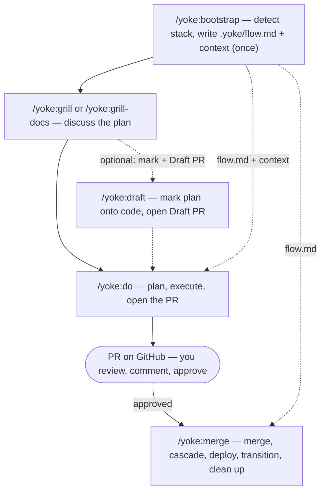

# yoke



A marketplace of skills and commands for Claude Code, inspired by:

- [obra/superpowers](https://github.com/obra/superpowers).
- [obra/the-elements-of-style](https://github.com/obra/the-elements-of-style)
- [anthropics/claude-plugins-official](https://github.com/anthropics/claude-plugins-official)

## Installation

```bash
# Add the marketplace
claude marketplace add github:yokeloop/yoke

# Locally (for development)
git clone https://github.com/yokeloop/yoke.git
claude --plugin-dir ./yoke
```

## How to use

Run `/yoke:bootstrap` once to prepare the project — it detects the stack and writes `.yoke/flow.md`, the map every other skill reads. Then the everyday loop is three steps: **grill → do → PR on GitHub → merge**.

```
/yoke:bootstrap                  # one-time: detect stack, scaffold .yoke/, write flow.md + CLAUDE.md

/yoke:grill <idea>               # interview yourself into a shared plan
/yoke:do                         # execute end to end — worktree, commits, push, and open the PR
#  → review the PR on GitHub, comment, approve
/yoke:merge                      # run the post-PR tail from flow.md: merge, cascade, deploy, clean up
```

`/yoke:do` drives every run to a ready pull request and stops there — the merge decision stays yours, made on GitHub. `/yoke:draft` optionally projects the agreed plan onto the code as Markup and opens a Draft PR to review and comment before `/do` implements it. `/yoke:grill-docs` is `/yoke:grill` plus a maintained glossary and ADRs. For larger, trackable work, spec it first with `/yoke:prd` + `/yoke:issues`, then hand the epic or sub-task URL to `/yoke:do`. See **Full cycle** below for the complete pipeline.

## Skills

<!-- yoke:skills:start -->

| Command            | What it does                                                                                                                                                                                                                                              | Output                                                                                                |
| ------------------ | --------------------------------------------------------------------------------------------------------------------------------------------------------------------------------------------------------------------------------------------------------- | ----------------------------------------------------------------------------------------------------- |
| `/yoke:bootstrap`  | Prepares a project for the yoke flow — stack detection, scaffolding the `.yoke/` layout, and generation of CLAUDE.md, `.yoke/yoke-context.md`, and `.yoke/flow.md`.                                                                                       | —                                                                                                     |
| `/yoke:do`         | Executes a task per plan.                                                                                                                                                                                                                                 | ready PR link(s), report at `.yoke/ai/<slug>/<slug>-report.md`, ticket comment, STAGE_COMPLETE notify |
| `/yoke:gca`        | Git staging and commit with smart file grouping.                                                                                                                                                                                                          | —                                                                                                     |
| `/yoke:gp`         | Git push with checks and report.                                                                                                                                                                                                                          | —                                                                                                     |
| `/yoke:grill`      | Interviews the user one interactive question at a time about a plan or design, walking each branch of the decision tree to a shared understanding; every question offers a recommended answer.                                                            | —                                                                                                     |
| `/yoke:grill-docs` | Docs-aware grilling: interrogates the user's plan one question at a time AND maintains the domain glossary (.yoke/context.md) and architecture decision records (.yoke/adr/) inline as decisions crystallise.                                             | —                                                                                                     |
| `/yoke:handoff`    | Saves the live state of the current conversation to `.yoke/handoff/` so a fresh session resumes where this one stopped, referencing existing artifacts instead of duplicating them.                                                                       | —                                                                                                     |
| `/yoke:help`       | Explains how to use yoke and lists the available skills; also greets new users.                                                                                                                                                                           | —                                                                                                     |
| `/yoke:issues`     | Breaks a plan, spec, or PRD into independently-grabbable GitHub issues using vertical slices (tracer bullets), publishes them in dependency order, and saves a local index in .yoke/ai.                                                                   | —                                                                                                     |
| `/yoke:journal`    | Appends a concise, newest-first entry to `.yoke/journal.md` summarizing the session's real work and linking the relevant `.yoke/ai/<slug>/` artifacts — the first layer of yoke's connected memory.                                                       | —                                                                                                     |
| `/yoke:merge`      | The user-triggered finisher that executes the post-PR tail per `.yoke/flow.md`: merges the task's PR(s), runs cascade merges, runs deploy/release commands, moves the ticket to its target state, cleans up worktrees, and returns to the default branch. | merged PR(s), cascade merges, deploy/release runs, ticket transition, cleaned worktrees               |
| `/yoke:pr`         | Creates or updates a GitHub Pull Request.                                                                                                                                                                                                                 | —                                                                                                     |
| `/yoke:prd`        | Turns the current conversation and codebase understanding into a PRD, publishes it as a GitHub issue, and saves a local copy in .yoke/ai.                                                                                                                 | —                                                                                                     |
| `/yoke:review`     | Finds problems in code, fixes them and produces a report.                                                                                                                                                                                                 | —                                                                                                     |

<!-- yoke:skills:end -->

## Local skills (development)

Skills under `.claude/skills/` are tools for developing the yoke plugin itself. They are available when working in the repository but are not part of the published plugin.

### /yoke-create — skill factory

Full pipeline for creating a new skill: task analysis, design with a mermaid diagram, SKILL.md and agent implementation, quality validation (elements-of-style + skill-development), documentation integration. [Details →](docs/yoke-create.md)

```
/yoke-create a skill for automated code review with bug hunting
/yoke-create https://github.com/yokeloop/yoke/issues/44
```

**Output:** `skills/<name>/SKILL.md` + agents + docs + updated README and CLAUDE.md

### /yoke-release — plugin release

Quality checks (prose, structure, documentation, links), version bump, tag, push, GitHub release with changelog.

```
/yoke-release minor
/yoke-release 2.0.0
```

**Output:** new tag + GitHub release

### /yoke-validate — SKILL.md linter

Validates every `SKILL.md` changed in the current branch against elements-of-style (Strunk) and plugin-dev skill-development conventions; auto-fixes safe findings and reports the rest.

```
/yoke-validate
```

## Telegram notifications

When working on multiple projects in parallel (tmux + worktree), skills send contextual notifications to Telegram: when questions need an answer, when a task is complete, when something is blocked. [Details →](docs/notify.md)

Skills call `lib/notify.sh` inline; it POSTs directly to the Telegram Bot API via `curl` — no stop hook, no queue. Notification points across skills: `/bootstrap`, `/do`, `/merge`, `/pr`, `/review`, `/sync-docs`. Three types: ACTION_REQUIRED, STAGE_COMPLETE, ALERT. Opt-in via env vars `CC_TELEGRAM_BOT_TOKEN` and `CC_TELEGRAM_CHAT_ID`.

## Full cycle

yoke is a short loop: discuss, hand it to `/yoke:do`, review the PR, then `/yoke:merge`. `do` drives every run to a pull request and stops — the merge decision stays yours, made on GitHub. Every step is optional; start wherever the work sits.

**1. Prepare** (once per project):

```
/yoke:bootstrap                      # detect stack, scaffold .yoke/, write flow.md + CLAUDE.md
```

**2. Discuss** — stress-test the idea one question at a time:

```
/yoke:grill <plan>                   # read-only interview → shared understanding
/yoke:grill-docs <plan>              # …and capture terms (.yoke/context.md) + ADRs (.yoke/adr/)
```

**3. Execute to a PR** — `/yoke:do` runs end to end and stops at the pull request:

```
/yoke:do                             # no args → inline: plan, execute, open the PR in this session
/yoke:do <sub-task URL>              # sub-agents: plan → (pause on cold start) → implement one issue → PR
/yoke:do <epic URL>                  # team: parallel agents across all sub-issues → PR(s)
```

For larger work worth tracking, spec it first: `/yoke:prd` → an epic GitHub issue, `/yoke:issues` → tracer-bullet sub-task issues in dependency order, then hand a URL to `do`. Every mode finishes the same way: enter a worktree on the default branch, commit each task, push, open or update the PR, comment the PR link on the ticket, and notify. `do` never merges — the one exception is an explicit "straight to main" up front.

**4. Merge** — after you review and approve the PR on GitHub:

```
/yoke:merge                          # merge PR(s), cascade, deploy/release, move the ticket, clean up worktrees
```

`/yoke:merge` reads `.yoke/flow.md` and runs only the steps it declares. It is the user-triggered finisher and never runs on its own.

**Manual utilities.** `/yoke:review`, `/yoke:gca`, `/yoke:gp`, and `/yoke:pr` are standalone tools that `do` now folds into its finish. Reach for them only outside a `do` run — reviewing existing changes, committing or pushing by hand, or opening a PR on its own. `/yoke:journal` saves session memory (manual, end of session); `/yoke:handoff` compacts the conversation for a fresh agent at any point.

## Structure

```
yoke/
├── .claude/
│   └── skills/              # local skills (plugin development)
│       ├── yoke-create/     # skill factory
│       ├── yoke-release/    # plugin release
│       ├── yoke-validate/   # SKILL.md linter
│       └── sync-docs/       # regenerate the skill catalog (repo-internal)
├── .claude-plugin/
│   ├── plugin.json          # plugin manifest
│   └── marketplace.json     # marketplace registry
├── skills/
│   ├── help/                # how to use yoke
│   ├── bootstrap/           # prepare project for yoke flow
│   │   ├── SKILL.md
│   │   ├── agents/          # stack-detector, architecture-mapper, convention-scanner, etc.
│   │   └── reference/
│   ├── do/                  # universal execution (inline / sub-agents / team), finishing at the PR
│   │   ├── SKILL.md
│   │   ├── agents/          # task-executor, task-reviewer, validator, formatter, doc-updater, plan-architect, task-investigator
│   │   └── reference/       # finish, mode-inline / mode-sub-agents / mode-team, status-protocol, report-format
│   ├── review/              # code review preparation
│   │   ├── SKILL.md
│   │   ├── agents/          # code-reviewer, single-fix-agent
│   │   └── reference/       # review-format
│   ├── gca/                 # git commit with smart grouping
│   │   ├── SKILL.md
│   │   └── reference/       # commit-convention, staging-strategy
│   ├── gp/                  # git push with checks
│   │   └── SKILL.md
│   ├── pr/                  # create and update PR
│   │   ├── SKILL.md
│   │   ├── agents/          # pr-body-generator
│   │   └── reference/       # pr-body-format
│   ├── merge/               # user-triggered finisher: merge, cascade, deploy, transition, clean up
│   │   ├── SKILL.md
│   │   └── reference/       # merge-procedure
│   ├── grill/               # interactive plan grilling
│   │   └── SKILL.md
│   ├── grill-docs/          # grilling + .yoke/context.md glossary + ADRs
│   │   ├── SKILL.md
│   │   └── reference/       # CONTEXT-FORMAT, ADR-FORMAT, domain-docs
│   ├── prd/                 # PRD from context → GitHub issue
│   │   └── SKILL.md
│   ├── issues/              # break a plan/PRD into tracer-bullet issues
│   │   ├── SKILL.md
│   │   └── reference/       # github-issues
│   └── handoff/             # compact the conversation for another agent
│       └── SKILL.md
├── lib/
│   ├── notify.sh            # write library: skills call it to enqueue messages
│   ├── flow-read.sh         # read .yoke/flow.md → structured flow map (read-only)
│   ├── gp-precheck.sh       # gp: read-only pre-push state
│   ├── gp-push.sh           # gp: runs git push, collects report
│   └── pr-collect.sh        # pr: read-only data collection (paths, not contents)
└── docs/                    # per-skill documentation
```

### Artifact root (`.yoke/`)

Skills write their artifacts under `.yoke/` in the target project:

- `.yoke/flow.md` — the flow map: repos + finish policies, branch cascade, deploy commands, tracker, artifacts. Written by `/bootstrap`, read by every skill via `lib/flow-read.sh` (`/do` and `/merge` consume it).
- `.yoke/yoke-context.md` — generated project profile: stack, architecture, conventions
- `.yoke/context.md` — domain glossary
- `.yoke/adr/` — architecture decision records
- `.yoke/ai/<slug>/` — per-task pipeline artifacts (PRD, task, plan, report, exploration, issues index)
- `.yoke/journal.md` — session journal

`.yoke/` is committed to git by default. Only `.yoke/sync-docs-tmp/` is gitignored. Skills always write under `.yoke/` and commit unless `.yoke/` is ignored.

## Planned skills

`/polish` `/qa` `/memorize`

## Development

Skill:

```
skills/<name>/SKILL.md
```

The format uses YAML frontmatter with `name` and `description`.

## Interactive review (revdiff)

yoke delegates interactive artifact review to [revdiff](https://github.com/umputun/revdiff) — a terminal TUI shipped as a separate Claude Code plugin. revdiff opens task files, plan files, and /do diffs for inline annotation; yoke folds the annotations back into the artifact.

### Install

```text
/plugin marketplace add umputun/revdiff
/plugin install revdiff@umputun-revdiff
```

### Terminal requirements

revdiff launches inside a terminal overlay. One of the following is required; otherwise the plugin exits with an error.

- tmux
- Zellij
- kitty
- wezterm
- Kaku
- cmux
- ghostty (macOS only)
- iTerm2 (macOS only)
- Emacs vterm

### Usage in yoke

Each yoke skill that produces an artifact offers "Review via revdiff" at its Complete phase.

- Plan file (from `/yoke:do` planning phase):
  ```text
  /revdiff --only .yoke/ai/<slug>/<slug>-plan.md
  ```
  Reviews the markdown plan file before execution proceeds.
- Code changes (from `/yoke:do` execution phase):
  ```text
  /revdiff <base>...HEAD
  ```
  Reviews the diff produced by /do against the default branch. `<base>` resolves via the cascade `origin/HEAD` → `origin/main` → `origin/master` → `main` (see `skills/do/SKILL.md`).

### Annotation fold-back

revdiff returns structured annotations on quit. For plan files, yoke applies the annotations in place and overwrites the file. For /do code review, yoke appends the annotations to the execution report at `.yoke/ai/<slug>/<slug>-report.md` under a `## Review notes` heading.

See https://github.com/umputun/revdiff (MIT) for binary install paths and deeper documentation.

## License

MIT
