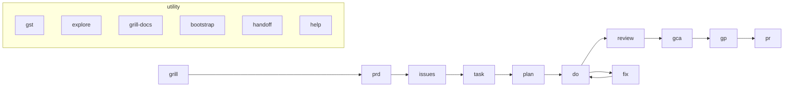

# yoke



A marketplace of skills and commands for Claude Code, inspired by:

- [obra/superpowers](https://github.com/obra/superpowers).
- [obra/the-elements-of-style](https://github.com/obra/the-elements-of-style)
- [anthropics/claude-plugins-official](https://github.com/anthropics/claude-plugins-official)

## Installation

```bash
# Add the marketplace
claude marketplace add github:yokeloop/yoke

# Locally (for development)
git clone https://github.com/yokeloop/yoke.git
claude --plugin-dir ./yoke
```

## How to use

After install, start with the help skill, prepare the project, then run the pipeline:

```
/yoke:help               # overview of skills
/yoke:bootstrap          # detect stack, generate CLAUDE.md
/yoke:task <ticket>      # define the first task
```

See **Full cycle** below for the complete pipeline.

## Skills

<!-- yoke:skills:start -->

| Command            | What it does                                                                                                                                                                                                                                                   | Output |
| ------------------ | -------------------------------------------------------------------------------------------------------------------------------------------------------------------------------------------------------------------------------------------------------------- | ------ |
| `/yoke:bootstrap`  | Prepares a project for the yoke flow — stack detection, generation of CLAUDE.md and yoke-context.md.                                                                                                                                                           | —      |
| `/yoke:do`         | Executes a task per plan.                                                                                                                                                                                                                                      | —      |
| `/yoke:explore`    | Codebase exploration and brainstorming.                                                                                                                                                                                                                        | —      |
| `/yoke:fix`        | Quick fix or follow-up change.                                                                                                                                                                                                                                 | —      |
| `/yoke:gca`        | Git staging and commit with smart file grouping.                                                                                                                                                                                                               | —      |
| `/yoke:gp`         | Git push with checks and report.                                                                                                                                                                                                                               | —      |
| `/yoke:grill`      | Interviews the user one interactive question at a time about a plan or design, walking each branch of the decision tree to a shared understanding; every question offers a recommended answer.                                                                 | —      |
| `/yoke:grill-docs` | Docs-aware grilling: interrogates the user's plan one question at a time AND maintains the domain glossary (.yoke/context.md) and architecture decision records (.yoke/adr/) inline as decisions crystallise.                                                  | —      |
| `/yoke:gst`        | Shows development status in the repository: branch, uncommitted changes, recent commits, diff vs main, hot files, semantic summary.                                                                                                                            | —      |
| `/yoke:handoff`    | Compacts the current conversation into a handoff document so a fresh agent can continue the work, referencing existing artifacts instead of duplicating them.                                                                                                  | —      |
| `/yoke:help`       | Explains how to use yoke and lists the available skills; also greets new users.                                                                                                                                                                                | —      |
| `/yoke:issues`     | Breaks a plan, spec, or PRD into independently-grabbable GitHub issues using vertical slices (tracer bullets), publishes them in dependency order, and saves a local index in .yoke/ai.                                                                        | —      |
| `/yoke:plan`       | Builds an implementation plan from a task file.                                                                                                                                                                                                                | —      |
| `/yoke:pr`         | Creates or updates a GitHub Pull Request.                                                                                                                                                                                                                      | —      |
| `/yoke:prd`        | Turns the current conversation and codebase understanding into a PRD, publishes it as a GitHub issue, and saves a local copy in .yoke/ai.                                                                                                                      | —      |
| `/yoke:review`     | Finds problems in code, fixes them and produces a report.                                                                                                                                                                                                      | —      |
| `/yoke:sync-docs`  | Regenerates the public skill catalog from `skills/*/SKILL.md` — per-skill MDX pages under `site/src/content/docs/skills/`, the table between `<!-- yoke:skills:start -->` markers in `README.md`, and the bullet list between the same markers in `CLAUDE.md`. | —      |
| `/yoke:task`       | Drafts a task file for AI implementation.                                                                                                                                                                                                                      | —      |

<!-- yoke:skills:end -->

## Local skills (development)

Skills under `.claude/skills/` are tools for developing the yoke plugin itself. They are available when working in the repository but are not part of the published plugin.

### /yoke-create — skill factory

Full pipeline for creating a new skill: task analysis, design with a mermaid diagram, SKILL.md and agent implementation, quality validation (elements-of-style + skill-development), documentation integration. [Details →](docs/yoke-create.md)

```
/yoke-create a skill for automated code review with bug hunting
/yoke-create https://github.com/yokeloop/yoke/issues/44
```

**Output:** `skills/<name>/SKILL.md` + agents + docs + updated README and CLAUDE.md

### /yoke-release — plugin release

Quality checks (prose, structure, documentation, links), version bump, tag, push, GitHub release with changelog.

```
/yoke-release minor
/yoke-release 2.0.0
```

**Output:** new tag + GitHub release

### /yoke-validate — SKILL.md linter

Validates every `SKILL.md` changed in the current branch against elements-of-style (Strunk) and plugin-dev skill-development conventions; auto-fixes safe findings and reports the rest.

```
/yoke-validate
```

## Telegram notifications

When working on multiple projects in parallel (tmux + worktree), skills send contextual notifications to Telegram: when questions need an answer, when a task is complete, when something is blocked. [Details →](docs/notify.md)

13 notification points across 8 skills: `/bootstrap`, `/task`, `/plan`, `/do`, `/fix`, `/pr`, `/review`, `/sync-docs`. Three types: ACTION_REQUIRED, STAGE_COMPLETE, ALERT. Opt-in via env vars `CC_TELEGRAM_BOT_TOKEN` and `CC_TELEGRAM_CHAT_ID`.

## Full cycle

Optional discovery & specification front-end:

```
/yoke:grill <plan>                   # stress-test the idea interactively
/yoke:grill-docs <plan>              # …and capture terms (.yoke/context.md) + ADRs
/yoke:prd                            # turn the discussion into a PRD → GitHub issue
/yoke:issues                         # break it into tracer-bullet issues
```

Core pipeline:

```
/yoke:task <ticket or description>   # define the task
  → answer questions in the file
/yoke:plan <path to task file>       # build the plan
  → answer questions in the file
/yoke:do <path to plan file>         # execute the plan
/yoke:fix <description>              # quick fix after /do
/yoke:review <slug>                  # prepare the review
/yoke:gp                             # push to remote
/yoke:pr                             # create a pull request
```

`/yoke:handoff` compacts the conversation for a fresh agent at any point.

## Structure

```
yoke/
├── .claude/
│   ├── skills/              # local skills (plugin development)
│   │   ├── yoke-create/     # skill factory
│   │   ├── yoke-release/    # plugin release
│   │   └── yoke-validate/   # SKILL.md linter
│   └── commands/            # local dev commands (journal)
├── .claude-plugin/
│   ├── plugin.json          # plugin manifest
│   └── marketplace.json     # marketplace registry
├── skills/
│   ├── help/                # how to use yoke
│   ├── bootstrap/           # prepare project for yoke flow
│   │   ├── SKILL.md
│   │   ├── agents/          # stack-detector, architecture-mapper, convention-scanner, etc.
│   │   └── reference/
│   ├── task/                # task definition
│   │   ├── SKILL.md
│   │   ├── agents/          # task-investigator
│   │   ├── reference/       # synthesize-guide, frontend-guide, elements-of-style
│   │   └── examples/
│   ├── plan/                # planning
│   │   ├── SKILL.md
│   │   ├── agents/          # plan-architect
│   │   ├── reference/       # routing-rules, plan-format, elements-of-style
│   │   └── examples/
│   ├── do/                  # plan execution
│   │   ├── SKILL.md
│   │   ├── agents/          # task-executor, task-reviewer, validator, formatter, code-polisher, doc-updater
│   │   └── reference/       # status-protocol, report-format
│   ├── review/              # code review preparation
│   │   ├── SKILL.md
│   │   ├── agents/          # code-reviewer, single-fix-agent
│   │   └── reference/       # review-format
│   ├── gca/                 # git commit with smart grouping
│   │   ├── SKILL.md
│   │   └── reference/       # commit-convention, staging-strategy
│   ├── gp/                  # git push with checks
│   │   └── SKILL.md
│   ├── pr/                  # create and update PR
│   │   ├── SKILL.md
│   │   ├── agents/          # pr-body-generator
│   │   └── reference/       # pr-body-format
│   ├── fix/                 # quick fix (1–3 files)
│   │   ├── SKILL.md
│   │   ├── agents/          # fix-context-collector, fix-investigator, fix-log-writer
│   │   └── reference/       # fix-log-format
│   ├── explore/             # codebase exploration and brainstorming
│   │   ├── SKILL.md
│   │   ├── agents/          # explore-agent, explore-log-writer
│   │   └── reference/       # exploration-log-format
│   ├── grill/               # interactive plan grilling
│   │   └── SKILL.md
│   ├── grill-docs/          # grilling + .yoke/context.md glossary + ADRs
│   │   ├── SKILL.md
│   │   └── reference/       # CONTEXT-FORMAT, ADR-FORMAT, domain-docs
│   ├── prd/                 # PRD from context → GitHub issue
│   │   └── SKILL.md
│   ├── issues/              # break a plan/PRD into tracer-bullet issues
│   │   ├── SKILL.md
│   │   └── reference/       # github-issues
│   ├── handoff/             # compact the conversation for another agent
│   │   └── SKILL.md
│   ├── gst/                 # repository status
│   │   └── SKILL.md
│   └── sync-docs/           # regenerate public skill catalog
│       ├── SKILL.md
│       └── reference/       # mdx-template, sync-spec
├── hooks/
│   ├── hooks.json           # Stop hook registration (Telegram notifications)
│   └── notify.sh            # delivery script: reads the queue → sends to Telegram
├── lib/
│   ├── notify.sh            # write library: skills call it to enqueue messages
│   ├── gp-precheck.sh       # gp: read-only pre-push state
│   ├── gp-push.sh           # gp: runs git push, collects report
│   ├── pr-collect.sh        # pr: read-only data collection (paths, not contents)
│   └── gst-collect.sh       # gst: read-only repository status data
└── docs/                    # per-skill documentation
```

### Artifact root (`.yoke/`)

Skills write their artifacts under `.yoke/` in the target project:

- `.yoke/context.md` — domain glossary
- `.yoke/adr/` — architecture decision records
- `.yoke/ai/<slug>/` — per-task pipeline artifacts (PRD, task, plan, report, exploration, issues index)
- `.yoke/journal.md` — session journal

`.yoke/` is committed to git by default. Only `.yoke/sync-docs-tmp/` and `.yoke/notify-pending.json` are gitignored. Skills always write under `.yoke/` and commit unless `.yoke/` is ignored.

## Planned skills

`/polish` `/qa` `/memorize` `/merge`

## Development

Skill:

```
skills/<name>/SKILL.md
```

Command (local-only, not shipped):

```
.claude/commands/<name>.md
```

Both formats use YAML frontmatter with `name` and `description`.

## Interactive review (revdiff)

yoke delegates interactive artifact review to [revdiff](https://github.com/umputun/revdiff) — a terminal TUI shipped as a separate Claude Code plugin. revdiff opens task files, plan files, and /do diffs for inline annotation; yoke folds the annotations back into the artifact.

### Install

```text
/plugin marketplace add umputun/revdiff
/plugin install revdiff@umputun-revdiff
```

### Terminal requirements

revdiff launches inside a terminal overlay. One of the following is required; otherwise the plugin exits with an error.

- tmux
- Zellij
- kitty
- wezterm
- Kaku
- cmux
- ghostty (macOS only)
- iTerm2 (macOS only)
- Emacs vterm

### Usage in yoke

Each yoke skill that produces an artifact offers "Review via revdiff" at its Complete phase.

- Task file (from `/yoke:task` Phase 5):
  ```text
  /revdiff --only .yoke/ai/<slug>/<slug>-task.md
  ```
  Reviews the markdown task file.
- Plan file (from `/yoke:plan` Phase 4):
  ```text
  /revdiff --only .yoke/ai/<slug>/<slug>-plan.md
  ```
  Reviews the markdown plan file.
- Code changes (from `/yoke:do` Phase 6):
  ```text
  /revdiff <base>...HEAD
  ```
  Reviews the diff produced by /do against the default branch. `<base>` resolves via the cascade `origin/HEAD` → `origin/main` → `origin/master` → `main` (see `skills/do/SKILL.md` Phase 6).

### Annotation fold-back

revdiff returns structured annotations on quit. For task and plan files, yoke applies the annotations in place and overwrites the file. For /do code review, yoke appends the annotations to the execution report at `.yoke/ai/<slug>/<slug>-report.md` under a `## Review notes` heading.

See https://github.com/umputun/revdiff (MIT) for binary install paths and deeper documentation.

## License

MIT
